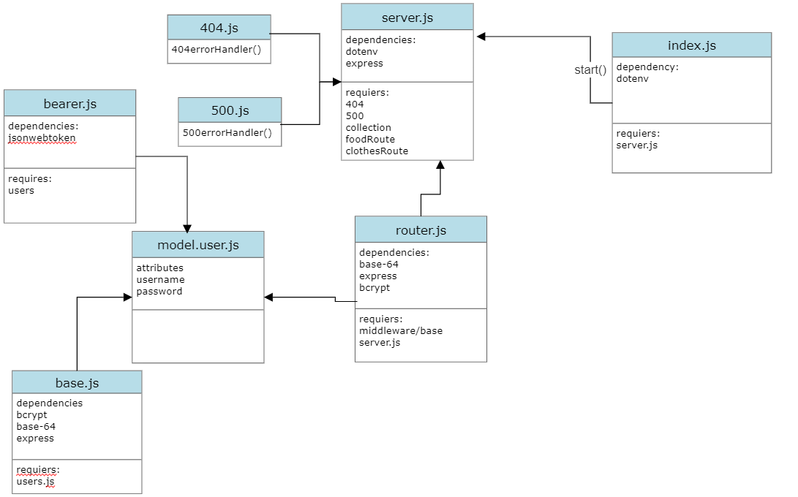

# bearer-auth
[gitHub](https://github.com/alsatarysamah/bearer-auth)

[PR](https://github.com/alsatarysamah/bearer-auth/pull/2)

[heroKu](https://samah-basic-bearer.herokuapp.com/)

[Action](https://github.com/alsatarysamah/bearer-auth/actions)

# problem domain 
## using the Token to re-authenticate users to shield access to any route that requires a valid login to access

**“Auth” routes for handling the login and authentication system**

- POST /signup to create an account

- POST /signin to login with Basic Auth

- GET /oauth

**Middleware for handling 404 and 500 conditions**

**Middleware for handling each type of authentication**

- Basic (username + password) to be used on the /signin route only

- i.e. app.post('/signin', basicAuthentication, (req, res) => { ... })

**OAuth (3rd Party) to be used on the /oauth route only**

- i.e. app.get('/oauth', OAuth, (req, res) => { ... })

- Handles the handshake process from a 3rd party OAuth system
